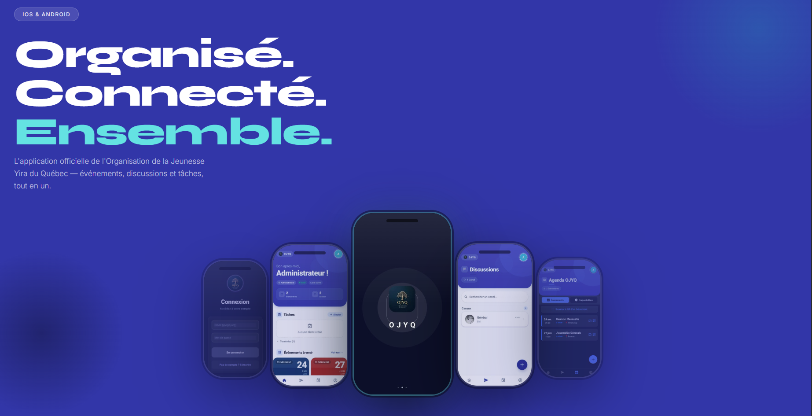
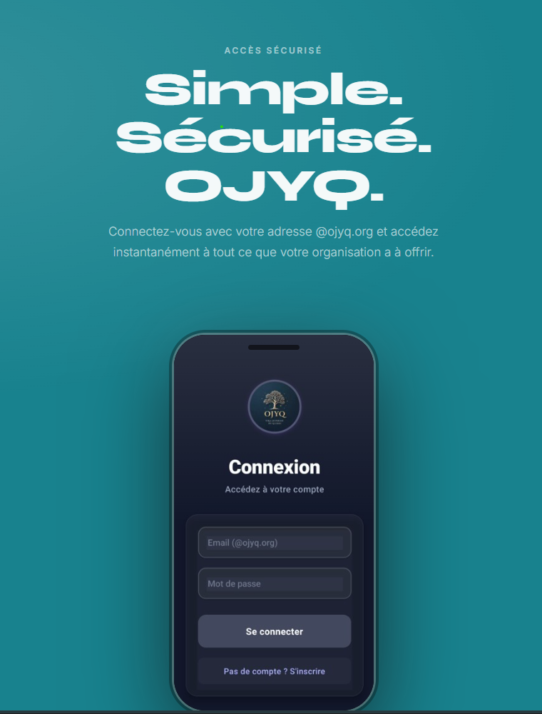
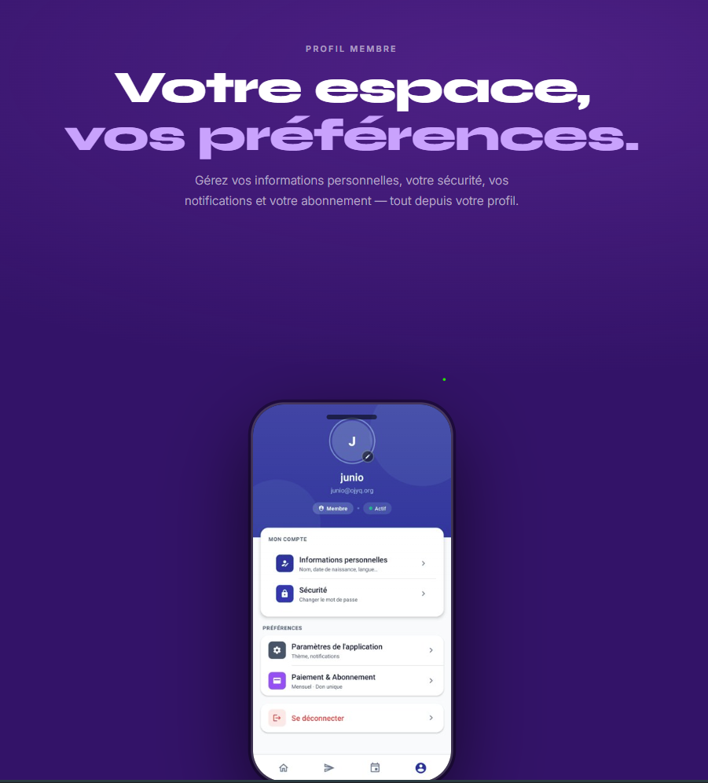

# OJYQ — Application Mobile

Application mobile de gestion associative pour **OJYQ**, construite avec React Native + Expo. Disponible sur iOS, Android et Web.

---

## Aperçu de l'application

|  |

| Messagerie | Connexion | Profil |
|:---:|:---:|:---:|
|  |  |  |

| Accueil | Canaux | Calendrier |
|:---:|:---:|:---:|
|  |  |  |


---

## Fonctionnalités

- **Authentification** — Connexion / inscription via Firebase Auth
- **Accueil** — Tableau de bord personnalisé selon le rôle de l'utilisateur
- **Chat** — Messagerie en temps réel par canaux, réactions, pièces jointes (image, vidéo, audio, document)
- **Calendrier** — Gestion d'événements et horaires de permanence
- **Présence** — Suivi de présence des membres
- **Profil** — Édition du profil, sécurité, paiement, paramètres
- **Administration** — Gestion des membres et des rôles (Président / Administrateur / Vice-Président)
- **Trésorerie** — Suivi des paiements des membres

### Rôles disponibles
`Visiteur` · `Membre` · `Conseiller` · `Responsable Loisir` · `Responsable Discipline` · `Responsable Communication` · `Vice-Responsable Communication` · `Secrétaire` · `Vice-Secrétaire` · `Trésorier` · `Vice-Trésorier` · `Vice-Président` · `Président` · `Administrateur`

---

## Stack technique

| Catégorie | Technologie |
|---|---|
| Framework | React Native 0.81 + Expo SDK 54 |
| Navigation | Expo Router (file-based) |
| Backend | Firebase Firestore + Firebase Auth |
| Stockage fichiers | Cloudflare R2 (via Worker) |
| UI | ThemeContext custom (dark/light mode) |
| Animations | React Native Reanimated 4 |
| Calendrier | react-native-calendars |
| Chat | Socket temps réel Firestore |
| Notifications | Expo Notifications |

---

## Prérequis

- [Node.js](https://nodejs.org/) >= 18
- [Expo CLI](https://docs.expo.dev/get-started/installation/) : `npm install -g expo-cli`
- [EAS CLI](https://docs.expo.dev/eas/) (pour les builds) : `npm install -g eas-cli`
- Compte Firebase avec Firestore et Auth activés
- (Optionnel) Compte Cloudflare pour le stockage fichiers

---

## Installation

```bash
# 1. Cloner le dépôt
git clone <repo-url>
cd app-react-native-ojyq

# 2. Installer les dépendances
npm install

# 3. Configurer les variables d'environnement
#    Ajouter GoogleService-Info.plist (iOS) et google-services.json (Android)
#    à la racine du projet
```

---

## Lancer l'application

```bash
# Démarrer le serveur de développement (affiche un QR code)
npx expo start

# ou via npm
npm start
```

Après le démarrage, plusieurs options sont disponibles dans le terminal :

| Option | Description |
|---|---|
| `a` | Ouvrir sur un émulateur Android |
| `i` | Ouvrir sur le simulateur iOS (macOS uniquement) |
| `w` | Ouvrir dans le navigateur (web) |
| Scanner le QR | Ouvrir sur un appareil physique avec **Expo Go** |

```bash
# Lancer directement sur une plateforme spécifique
npm run web       # Navigateur
npm run android   # Émulateur / appareil Android
npm run ios       # Simulateur iOS (macOS uniquement)
```

---

## Build & Déploiement

```bash
# Build Android (APK / AAB)
eas build --platform android

# Build iOS
eas build --platform ios

# Export Web (statique)
npm run build
```

---

## Structure du projet

```
app-react-native-ojyq/
├── app/                        # Routes (Expo Router)
│   ├── (tabs)/                 # Onglets principaux
│   │   ├── index.tsx           # Accueil
│   │   ├── chat.tsx            # Chat
│   │   ├── calendar.tsx        # Calendrier
│   │   └── profile.tsx         # Profil
│   ├── account/                # Pages compte
│   │   ├── edit.tsx
│   │   ├── settings.tsx
│   │   ├── security.tsx
│   │   └── payment.tsx
│   ├── admin/                  # Pages administration
│   │   ├── members.tsx
│   │   └── member-edit.tsx
│   ├── channel/[id].tsx        # Canal de chat
│   ├── attendance.tsx          # Présence
│   ├── treasury/               # Trésorerie
│   └── auth/auth-screen.tsx    # Authentification
├── components/                 # Composants réutilisables
│   ├── chat/
│   ├── ui/
│   └── ...
├── contexts/                   # Contextes React (ThemeContext, ...)
├── hooks/                      # Hooks personnalisés
├── theme/                      # Palettes et tokens de design
├── assets/                     # Images, fonts, screenshots
├── cf-worker/                  # Cloudflare Worker (upload R2)
└── app.json                    # Configuration Expo
```

---

## Variables d'environnement

Les fichiers suivants sont nécessaires mais non versionnés (`.gitignore`) :

| Fichier | Description |
|---|---|
| `GoogleService-Info.plist` | Config Firebase iOS |
| `google-services.json` | Config Firebase Android |

---

## Linter

```bash
npm run lint
```

---

## Version

**1.0.3** — Dernière mise à jour : 03/04/2026
